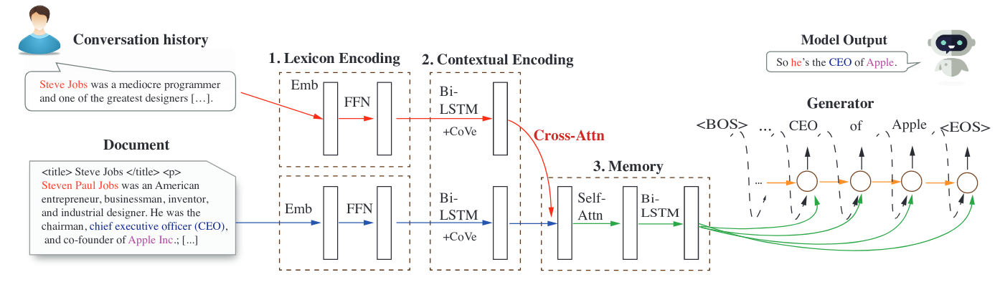

1. [Delaying Interaction Layers in Transformer-based Encoders for Efficient OpenDomain Question Answering](https://arxiv.org/pdf/2010.08422.pdf)

2. [Transformer Based Memory Network forSentiment Analysis of Web Comments](https://ieeexplore.ieee.org/stamp/stamp.jsp?tp=&arnumber=8918438)

